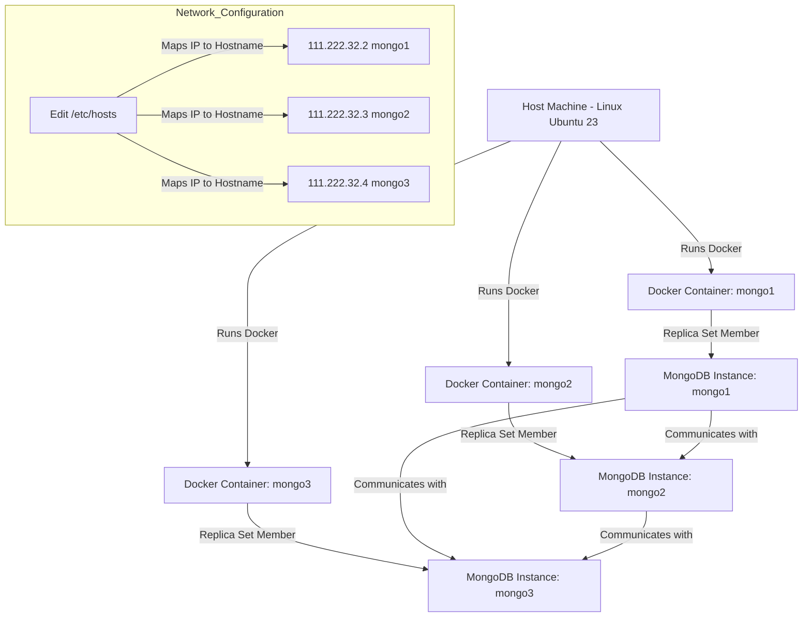

# Why Use DNS and IP Configuration?

1. **Hostname Resolution**:
   - **DNS (Domain Name System)** translates human-readable hostnames (like `mongo1`) into IP addresses. This is crucial because MongoDB instances in a replica set need to communicate with each other using these addresses.
   - Using hostnames instead of IP addresses helps avoid issues if the IP addresses change. For example, if you restart a container or move it to a different network, the IP might change, but the hostname remains the same.
2. **Localhost vs. Container Network**:
   - **Localhost** refers to the loopback network interface of your host machine. When you run any app on your local machine, `localhost` works fine because it points to the same machine and therefore the local development app.
   - In a Docker environment, each container has its own network namespace. This means `localhost` inside a container refers to the container itself, not the host machine or other containers. Hence, you need to use the container’s hostname or IP address to connect to other containers.
3. **Replica Set Communication**:
   - A replica set requires each MongoDB instance to recognize and communicate with the others. This is why you need to configure the `/etc/hosts` file or use a DNS service to resolve the hostnames to the correct IP addresses.
   - The MongoDB client needs to know the addresses of all members in the replica set to manage replication and failover processes effectively.

## Simplifying the Process

While it might seem complex, these steps ensure that your MongoDB replica set is robust and can handle network changes without manual intervention. In a production environment, using DNS services provided by your cloud provider can simplify this process significantly.

## Diagram

## References

1. [Linux Networking: DNS](https://yuminlee2.medium.com/linux-networking-dns-7ff534113f7d#:~:text=When%20a%20Linux%20system%20needs,finds%20the%20correct%20IP%20address.)
